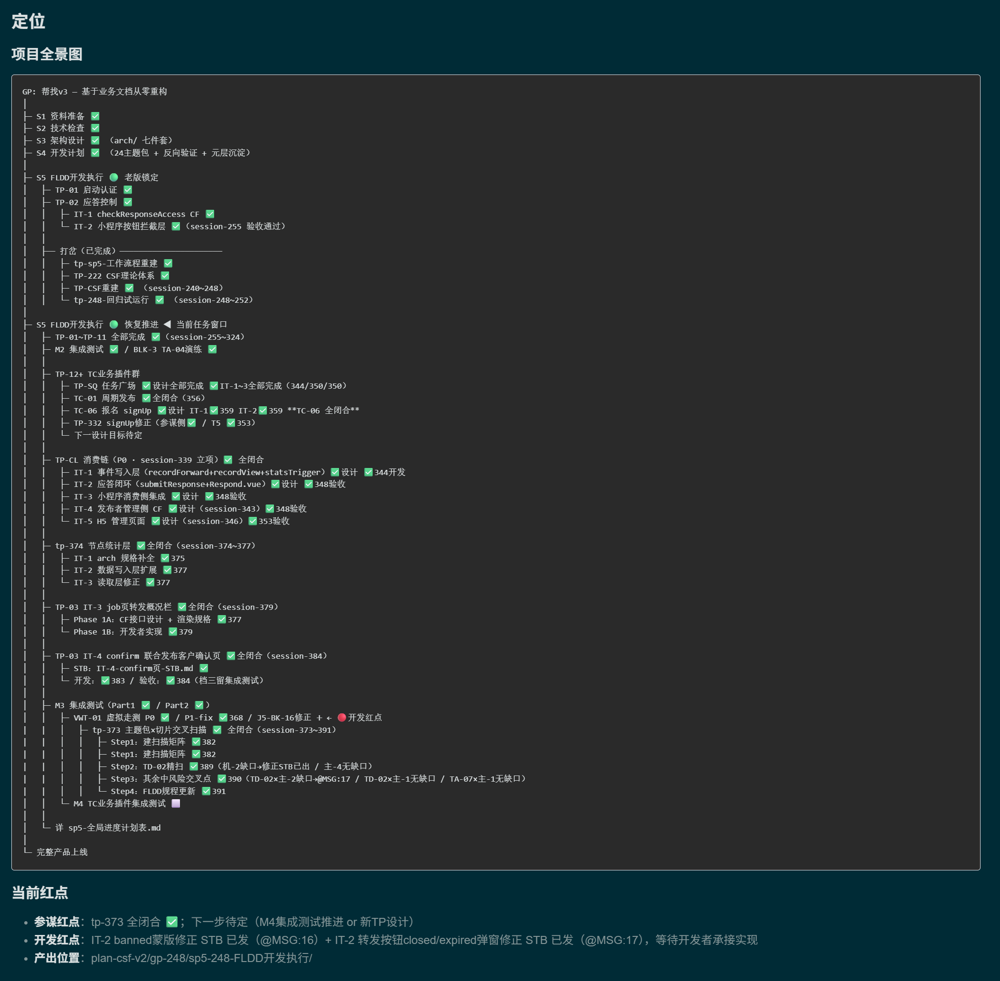

# CSF — Collaboration Specification Framework

<div align="center" markdown="1">

[简体中文](README.md) | **English**

</div>

> A human-AI collaboration framework that works **with** LLM nature, not around it. Built on natural language and purpose — making RAG, agent orchestration, and elaborate prompt engineering **unnecessary, not unavailable**. Home of the Pang Principle.

📖 **Read on the web**：<https://huidev2025.github.io/CSF/>

---

## What is CSF?

Mainstream LLM engineering workflows treat the inherent constraints of language models (limited context window, lack of persistent memory, probabilistic behavior) as defects to overcome using technical scaffolding — RAG, vector databases, multi-agent frameworks, and hyper-detailed prompt engineering.

CSF takes a different path: **accept these constraints as physical facts, and design within them**. As a result, the technical scaffolding disappears — not replaced, but losing its reason to exist.

See our Manifesto: [Manifesto: You Are Fighting the Wrong War](Manifesto-v3-You-Are-Fighting-the-Wrong-War.md)

---

## Where to Start Reading

In order, takes 5 minutes to start:

1. **[Manifesto](Manifesto-v3-You-Are-Fighting-the-Wrong-War.md)** — Why CSF exists, the Pang Principle.
2. **[QUICKSTART.md](QUICKSTART.md)** — Quickstart Guide (Bilingual): You don't need to write code, just express your purpose clearly.
3. **[csf-minimal/README.md](csf-minimal/README.md)** — CSF minimal teaser version, a 30-second summary + three core disparities.
4. **[csf-minimal/context.md](csf-minimal/context.md)** — A blank template you can copy and use directly.
5. **[csf-minimal/体验对比指南.md](csf-minimal/体验对比指南.md)** — A/B sandbox design to experience the disparity firsthand.

Deeper Theory:

6. **[essays/ — CSF Column Shelf](essays/README.md)** — "Working with Intelligence" flagship series, deeply analyzing the four engineering systems and collaborative philosophies.

See it in Action:

7. **[cases/bang-v3/ — Excerpts from 375 Sessions](cases/bang-v3/README.md)** — Three raw logs demonstrating our 4 concrete proofs (pushback, autonomy, planning, root-cause tracing).

> **First time here?** Start with **[QUICKSTART.md](QUICKSTART.md)**.

---

## Visual Guides

Two interactive maps to place CSF in the AI-coding landscape — takes about 2 minutes:

| Map | 中文 | English |
|---|---|---|
| **AI-Coding Evolutionary Landscape** (Timeline of 5 phases: Autocomplete -> Autonomous Agents -> CSF) | [查看](https://huidev2025.github.io/CSF/visuals/ai-coding-landscape-zh.html) | [View](https://huidev2025.github.io/CSF/visuals/ai-coding-landscape-en.html) |
| **Three Schools of Contrast & CSF Positioning** (The assumption and bottlenecks of Autonomous Agents vs SDD vs CSF) | [查看](https://huidev2025.github.io/CSF/visuals/csf-positioning-zh.html) | [View](https://huidev2025.github.io/CSF/visuals/csf-positioning-en.html) |

---

## Repository Structure

```
csf/
├── README.md                     # This file (Chinese complete)
├── README_en.md                  # Complete English version
├── QUICKSTART.md                 # Quickstart Guide (Bilingual)
├── LICENSE                       # CC BY-NC 4.0
├── CONTACT.md                    # Contact details (Bilingual)
├── 引言v3：...md                  # Chinese Introduction (Manifesto)
├── Manifesto-v3-You-Are-Fighting-the-Wrong-War.md   # English Manifesto
├── assets/                       # Image and qrcode resources
├── _dlog/                        # Public construction logs (working demonstration)
├── cases/                        # Real-world use cases (raw dialogue logs)
├── essays/                       # Flagship column ("Working with Intelligence" series + archives)
└── csf-minimal/                  # Minimal hands-on tutor pack
    ├── README.md
    ├── context.md                # Empty template ready for copy-paste
    └── 体验对比指南.md
```

---

## The CSF Stack

CSF is not a single document. It is a layered, **third-generation** system:

| Tier | For Whom |
|---|---|
| **csf-minimal** | Anyone, a 5-minute experience |
| **csf-lite** | Individuals / small teams running real projects |
| **csf-full** | SME engineering teams / enterprise-grade adoption |

**What csf-full is**: a working set of about **60 core protocol and experience files** that constitute an **engineering-grade human–AI collaboration management system** — a four-layer architecture (semantic management / collaboration / quality / evolution) + a three-role protocol (Owner / Chief-of-Staff / Developer) + the W-protocol (three tiers of verification) + the E8 experience-promotion pipeline + the D3 knowledge-routing system.

### Three Engineering Pillars — Placed Against the Industry

In **plain text, without a single line of glue code**, CSF v3 builds a **high-cohesion, low-coupling software-engineering management system** on three pillars:

#### ① Self-Sustaining

**Industry today**: humans serve as the scheduler — flipping through SOPs, reminding the LLM what to read next, which tool to invoke. The cognitive load on the human is enormous.

**CSF v3**: the AI **runs itself end-to-end**. The "engine" section in `context.md` defines a strict opening protocol (L1 load -> L2 task-level alignment -> L3 concrete plan). After reading `context.md` the AI knows which chains to load, where to retrieve resources, when to log to `session-NNN.md`, when to recalibrate, and how to close out. Control of "how to collaborate with the human" is **handed off from human cognition to the AI's own self-procedure**. The human becomes a *commander* (confirm / correct) rather than a *scheduler*.

#### ② Hot/Cold Separation in the Filesystem (Baseline–Log)

**Industry today**: in a typical LLM session, fresh and stale information sit side by side in one long transcript — triggering the well-known "Lost in the Middle" attention degradation.

**CSF v3**: cold/hot separation **at the filesystem level** —

- **Baseline layer** (`context.md`, *overwrite-style*) keeps only the current dehydrated state.
- **Log layer** (`session-NNN.md`, *append-only*) preserves the full reasoning trail for back-tracing when needed.

Every new session starts from concentrated, current information. The attention-degradation flaw is engineered around, not fought.

#### ③ Industrial-Grade Multi-Role: Physical Isolation + Async File-Based Comms

**Industry today**: multi-agent frameworks (CrewAI, AutoGen, …) let agents chat directly with each other. The common failure modes are "infinite recursion of debate", "noise amplification", and "mutual hallucination reinforcement".

**CSF v3**: the Chief-of-Staff (design) and the Developer (execution) **never converse directly**.

- The Chief-of-Staff writes a **STB (Simple Task Brief)** as the contract. The Developer is **forbidden** to read upstream `domain/` or `arch/`.
- The Developer self-checks every input through a **three-column classifier** — ✅ understood / 🟡 unsure / 🔵 working assumption. If any non-✅ remains, the work is **PENDING'd back**; no keystrokes.
- All cross-role communication happens through the filesystem with a sentinel format (`@MSG:N`), never as conversation.

“Isolation + deterministic feedback” is mature industrial software engineering applied to the AI-collaboration setting. Agents do not hallucinate at each other in conversation; humans do not get coerced into arbitrating runaway debates.

---

### What Has Been Verified, Plainly

CSF v3 was hardened inside a **real, two-front commercial product refactor** (WeChat Mini Program + H5 + cloud-function backend):

| Dimension | Number / Fact |
|---|---|
| Project | WeChat Mini Program + H5 + cloud-function backend, **two-front commercial product** |
| Inputs | Only **2** sources: legacy business docs + UI screenshots |
| Process | **395 sessions** — Owner **wrote no code at all** |
| Delivered | Architecture redesign -> modular partitioning -> business slicing -> specs -> **base implementation (everything except plugins) -> testing & verification** |
| Artifacts | **44** cloud functions + **532** source files + **132** plan/spec docs + **116** design docs |
| Hand-off | The full base was delivered to a professional engineering team for plugin development and final polish |
| **In Parallel** | The full CSF method itself, across **three iterations (v1 -> v2 -> v3)**, was produced *during* the project |

The Owner stayed at the level of *purpose and judgment* throughout — articulating business truth, calibrating direction, making value trade-offs. Architecture, partitioning, design, coding, and testing — CSF coordinated the path from *purpose* to *running code*.

### Honest Boundaries

- CSF cannot yet let someone with no software-engineering literacy ship a commercial product alone. The Owner needs business judgment and systems thinking — but **not coding ability**.
- CSF as a methodology is **not yet mature**. There is substantial work ahead (boundary conditions, degradation modes, experience-aging, the ongoing tension with the LLM training prior, …).
- CSF does not replace engineering teams. It is a method that makes the team's human–AI collaboration **regulated, quality-controllable, and efficient**.

### What CSF Has Demonstrably Proved

1. It can **autonomously plan and track work** — this very repository (README, Manifesto, CONTACT, _dlog, commit history) is being managed by CSF in front of you.
2. It can **detect deviation during execution, loop back to revise design, re-plan the fix, and drive the work to convergence** — see the raw dialogue logs in [cases/bang-v3/](cases/bang-v3/README.md).
3. It dramatically lifted the Owner's design / development / test throughput and quality. The Owner does not write code or docs. Every serious design defect during the project came from the Owner skipping a check — and every one of them was caught and repaired by the AI under the CSF protocol.
4. **Plans change. The AI's continuity holds.** Across hundreds of sessions and many mid-flight re-plans, the AI consistently knew where it was, where it came from, and where it was going.

#### Look at It: The Project State the AI Maintains for Itself

The picture below is the **project panorama and the current red dot — written, read, and overwritten by the AI inside `context.md`, *for its own next-session self***. It is not a dashboard for humans. It is not a post-hoc report. It is a live working artifact.

<p align="center">
  
</p>

Things to notice while reading it:

- The whole project, from S1 through M4, with multiple side-quests (CSF's own rebuild, regression dry-run, node-stats layer, the cross-scan matrix…) and multiple replans — and the AI is always aware of *where it is, where it came from, and where it has yet to go*.
- The three lines under "current red dot" (Chief-of-Staff red dot / Developer red dot / output location) let any new session pick up the work with **zero search**. That is the engineering payoff of the baseline–log separation plus the trigger index.
- This artifact survived hundreds of sessions, many workdays, many topic-package transitions, and many human–AI handovers — and remains clean, structured, and trustworthy. That is empirical evidence that an AI under the CSF protocol can hold a faithful "project memory" over the long run.

Compared with the industry status quo, very few LLM workflows produce a durable, AI-authored project state that the AI itself can rely on across long horizons, replans, and role rotations. CSF makes this routine.

---

### Theoretical Independence

The six independent contributions form a self-contained body of work that researchers can engage with on its own terms:

1. The consumer-side vs supply-side analytic frame
2. **Purpose-driven attention engineering** (not prompt engineering)
3. **Engineering-layer capability growth decoupled from the model layer** (same model + better engineering organization -> better results)
4. The filesystem as an extended-cognition substrate (extended cognition)
5. The D3 knowledge-routing system
6. The business-language amplification mechanism (the W-protocol's core epistemological insight: cross-language translation amplifies misunderstanding; business intuition is the detector)

If you are a decision-maker or engineering leader struggling with runaway RAG complexity, agent-orchestration cost, or stalled AI engineering adoption — read the [Manifesto](Manifesto-v3-You-Are-Fighting-the-Wrong-War.md) and [csf-minimal](csf-minimal/README.md), then reach out.

---

## Roadmap

- [x] Minimal teaching pack (csf-minimal)
- [x] Core introductory articles (Chinese introduction + English Manifesto)
- [x] License Selection (CC BY-NC 4.0)
- [x] Complete contact details (CONTACT.md, Bilingual)
- [x] Structured hands-on manual ([QUICKSTART.md](QUICKSTART.md), Bilingual)
- [ ] csf-lite Public teaser
- [ ] Industry cases & community feedback

### What Comes Next

I'll keep answering questions here (GitHub Issues / email) and, when topics deserve it, publish longer **column-style essays** in this repo for more systematic help. If you have a question, **just ask** — that is the most natural next step for this work.

---

## Contact

Developed and validated by **dapangangang** inside a real WeChat Mini-Program commercial project spanning over 395 sessions.

- **Chinese speakers**: Primarily based in the ZSXQ Paid Community 「一个人走」 (csf-lite, advanced tactics, case sharing). Public feedback via GitHub Issues. Email for commercial inquiries.
- **English speakers**: Email is the most direct way; GitHub Issues for public discussion.

👉 Full contact details: [CONTACT.md](CONTACT.md)

Email: **dapangangang@gmail.com**

---

## How to Cite

If CSF or "the Pang Principle" has helped you, feel free to copy any citation formats below.

**One-line citation (English)**

```markdown
[CSF — The Pang Principle](https://github.com/huidev2025/CSF) — dapangangang, 2026
```

**Full block citation**

```markdown
> “The value of AI comes from its intelligence.
> Trying to make it as reliable as a machine is exactly the act of destroying that value.”
> — The Pang Principle, dapangangang (CSF, 2026)
> https://github.com/huidev2025/CSF
```

**At the end of your project's `context.md`** (Recommended)

```html
<!-- Built with CSF · https://github.com/huidev2025/CSF -->
```

---

## License

The textual content of this repository is licensed under [**CC BY-NC 4.0**](https://creativecommons.org/licenses/by-nc/4.0/).

- Personal, academic, non-profit use: free to share and adapt with attribution.
- Commercial use requires permission — please reach out. Paid licensing is **not** the default.
- **Startups: free.**
- Unsure whether your use is commercial? Open an issue or email **dapangangang@gmail.com**.

---

## A Note Beyond the License

Legally, CC BY-NC asks for attribution. What I'd actually love more:

- If you use it, tell me what you're building — an issue, an email, a social-media @ all work.
- Not a requirement. Just to stay in touch.
- Startups are free; if it ends up helping you, come say hi when you've made it.

English inquiries: please read [CONTACT.md](CONTACT.md) · **dapangangang@gmail.com** · GitHub Issues

---

> ✍️ **A Note on Authorship**
>
> Articles in this repo are signed *by dapangangang with AI*.
> Two authors, **one corresponding author** —
> the AI is, well, famously forgetful :)
