# 上下文文件（context.md）增长率分析

方法：收集项目文件中不同时间点的 context.md 快照，统计非空行数

---

## 一、快照数据

| 时间点 | 约会话 | 非空行数 | 章节数 | Frontmatter | 说明 |
|--------|--------|----------|--------|-------------|------|
| SP-瘦身前 (约#136) | #136 | 2197 | 61 | 3 | `CONTEXT.md` |
| SP-瘦身后 (约#141) | #141 | 2256 | 61 | 7 | `CONTEXT.md` |
| 升级前 (约#214, 旧体系末期) | #214 | 674 | 4 | 16 | `CONTEXT.md` |
| CSF迁移初期 (约#256) | #256 | 240 | 5 | 99 | `context.md` |
| 升级后 (约#391, 当前) | #391 | 345 | 5 | 158 | `context.md` |

---

## 二、增长分析

**升级前**（#136→#214，78 会话）：
- 行数：2197 → 674（+-1523，平均 +-19.5 行/会话）

**升级后**（#256→#391，135 会话）：
- 行数：240 → 345（+105，平均 +0.8 行/会话）

**对比**：升级前每会话增长 +-19.5 行，升级后每会话增长 +0.8 行

---

## 三、Mermaid 时序图

```mermaid
gantt
    title context.md 非空行数变化
    dateFormat X
    axisFormat %s 会话

    section 行数
    SP-瘦身前 (约#136) :milestone, 136, 0
    section 行数
    SP-瘦身后 (约#141) :milestone, 141, 0
    section 行数
    升级前 (约#214, 旧体系末期) :milestone, 214, 0
    section 行数
    CSF迁移初期 (约#256) :milestone, 256, 0
    section 行数
    升级后 (约#391, 当前) :milestone, 391, 0
```

---

## 四、方法说明

- 快照来源：项目文件中不同时间点保存的 context.md 副本
- 行数统计：排除空行后的有效内容行数
- 章节数：`## ` 开头的二级标题数量
- 局限：快照时间点有限（5个），无法捕捉连续变化；升级后的快照仅2个（#256和#391）
- 建议：如需更细粒度的数据，可从 git 历史或会话记录中的文件内容引用中提取更多快照
