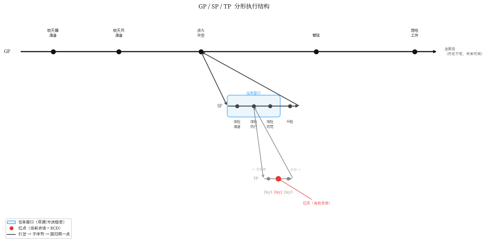

# 第二章：语义管理系统

> 产业界花了三年时间优化 " 什么进窗口 "。CSF 的问题是 " 为什么进 "——目的不清，再精准的检索也是噪声。

---

漂移不是信息损耗的问题。

2024 年，目的被硬编码在 System Prompt 的结尾——"Your goal is to…"。这个设计的问题很快暴露：目的是静态的，执行是动态的，随着会话推进，目的那句话的注意力权重相对衰减，漂移随之发生。

行业的响应是升级目的的工程形态。2025-2026 年，主流 AI 工程方法论开始将目的结构化处理：Goal as State Machine——目的被解构为意图状态与退出条件断言；Runtime Governance——独立的治理层在每一步输出后评估向量轨迹是否偏离目的边界；Why/What 分层——高阶推理模型负责目的锚定，执行层保持上下文纯净性，仅根据拆解出的子任务动态装载 Context。这个方向是对的：目的需要被结构化，不能只是一句描述性文本。[^1]

但这套方案的假设出了问题。

Anthropic 将这套工作命名为 "context engineering"：在推理期间策划和维护最优 token 集合。目的在这个框架里，即便被状态机化，仍然是上下文的组织依据，而不是协作结构的控制单元。Runtime Governance 守护的是目的的形式边界——向量轨迹、断言条件——这是在 token 层和状态层操作。[^2]

乓定律说：伴随时间，一个表达所承载的信息量会不可避免地增长，语义会被稀释。语义稀释不发生在 token 层，发生在语义层。向量距离无法判断目的是否失真——因为语义失真的目的，在向量空间里可能仍然很近。治理层拦截的是偏离，不是稀释。给它再精密的状态机，目的的语义完整性仍然没有保障，因为守护它的机制不在语义层。

**行业把目的的守护交给了治理层（外挂）。CSF 认为目的的守护必须内生于协作结构，且人不能退出这个回路。**

要理解这套内生机制如何工作，需要先建立执行结构的空间感。

---

## 2.1 执行结构：目的的分形容器



项目最大的目的，就是全景图的终点。

全景图不是计划书，是目的的空间展开。终点确定，路径随之分解：每个阶段有自己的目的，每个任务有自己的目的，目的套目的，形成 GP（全局计划）→ SP（阶段计划）→ TP（主题计划）的层级。每一层的内部结构和整体完全一样——任务可以无限分解，但每一级都必须有明确的目的，否则分解无效。

这个结构有三个关键元素：

**窗口**：资源、对象、方法保持稳定的工作阶段。窗口的边界不是日历，是 " 需要打交道的那套东西是否发生了根本性变化 "。窗口切换时，旧内容清空，新窗口装新的一套。

**红点**：当前焦点。知道红点在哪里，就知道：在做什么、上次做到哪里、这次要做什么。

**全景图**：历史节点不可变，未来节点随认知推进更新。它是项目当前认知的反映，不是冻结的承诺。

执行结构建立了目的存在的空间。但空间本身不传导目的——目的如何在每次会话中被激活、如何决定信息的切分方式、如何在无记忆约束下保持跨会话稳定，是接下来三节的问题。

---

## 2.2 三元组：目的的收敛装置

执行结构确定了目的在哪个尺度上存在——GP、SP、TP 各有自己的目的。下一个问题是：在单次会话这个尺度上，目的如何快速激活并收敛？

行业的升级方案是 Goal as State Machine——把目的解构为状态与断言条件，用治理层在运行时卡点 [^1]。这个方案解决了目的的可验证性问题，但引入了一个新问题：状态机是形式化的，目的是语义的。把语义目的压缩进状态断言，必然有信息损失。损失的那部分，正是业务判断和上下文理解——恰好是人最擅长、机器最难替代的部分。

CSF 的解法是三元组：**目的 + 方法 + 资源**。

三元组不是更详细的任务描述，也不是状态机的另一种写法。它是语义收敛装置——AI 读到三元组，语义系统自动收敛到正确的能力子集：知道在做什么（目的），知道用什么方式做（方法），知道去哪里找材料（资源）。三者缺一，收敛不完整。

三元组有严格的逻辑顺序。目的确定之前，方法没有意义。方法确定之前，资源没有边界。产业界习惯先列资源再想怎么用，这个顺序颠倒了因果——资源的边界由方法决定，方法的选择由目的决定。CSF 的顺序是目的→方法→资源，因果链从语义到操作，不可逆。

三元组是任务窗口的控制单元。窗口切换时，三元组整体覆写新的语境，旧的内容不再占用语义空间。目的的传导不依赖治理层的外部卡点，而是通过结构本身在每次会话启动时重新激活。

---

## 2.3 知识分层：目的决定信息的切分方式

三元组解决了单次会话的目的收敛。但目的要传导，还需要解决另一个问题：项目积累的知识如何组织，才能让每一层的执行者只看到它需要看到的？

行业的 Why/What 分层方案是：高阶推理模型负责目的锚定，执行层保持上下文纯净性。这个方向正确——执行层不应该被目的的全部复杂性淹没。但这个方案把 Why/What 的分离交给了模型能力（推理模型 vs 执行模型），而不是交给协作结构。模型能力是概率性的，协作结构是确定性的。

CSF 的知识组织原则是**逐层信息解耦**，由结构而非模型能力保证：

```
Domain（领域）→ Arch（架构）→ Themes（主题包）→ STB（任务书，Simple Task Brief）
```

**Domain** 是业务真相。Owner 的判断、产品的核心规则、不随实现变化的业务逻辑。权威性最高，变动最少。

**Arch** 是架构设计。把 Domain 的业务意图翻译成系统结构。

**Themes** 是设计契约。从 Domain 和 Arch 中提炼出开发者可以直接消费的材料——不是原始资料的摘要，是经过判断的设计决策。

**STB** 是单次会话的输入。修改哪些文件、参考哪些资料、每个任务点的验收断言。

每一层向下传递，都是一次有判断的信息精炼。上层为下层准备知识，回答同一个问题：**下一层需要知道什么和不知道什么，就能刚好完成它的任务？**

单向性是这个架构的核心，且不只是认知负载管理。如果开发者可以直接读 Domain，就会发生 " 语义穿透 "，他会用自己的理解去解读业务真相，绕过参谋长的判断层——业务语义的完整性会在这个绕过中损坏。信息只能从上游流向下游，**是对 " 语义穿透 " 的结构性防御**，而非权限设计。

---

## 2.4 定位管理与跨会话收敛：时机与连续性

知识分层解决了 " 装什么 "。剩下两个问题：**什么时候装**，以及**跨会话如何保持连续**。这两个问题是同一个机制的两个维度。

行业对上下文窗口的焦虑是容量焦虑。2M token 的长上下文模型出现后，焦虑并没有消失——窗口更大，注意力更稀释，漂移更隐蔽。Anthropic 的研究将其命名为 "context rot"：随着窗口内 token 数量增加，模型准确召回信息的能力下降，注意力预算被持续消耗。LangMem 等方案的路径是让模型自主决定什么值得固化——把记忆判断权交给模型。没有目的结构，模型不知道什么重要。[^2]

容量不是问题所在。问题是：在正确的时机，把正确的东西放进来。

**滑动窗口**管理任务阶段的切换。一个窗口内，三元组相对稳定——多个会话共享同一个窗口，变的只是每次会话的具体进度。窗口切换的触发条件是 " 需要打交道的那套东西整体换了 "，不是时间或任务数量。

**Lazy Loading** 管理文档的按需加载。规则触发（按协议在需要时才读对应规范）和口令触发（用户提醒特定场景，AI 加载对应规范）。核心原则：带着目的去读，才知道读到什么程度够了。

**索引三层**管理文档的可定位性：文件名自解释、主动指针（changelog 尾注标明资源作用域）、稳定引用（别称机制防止重命名断链）。

跨会话的连续性由 context 的四章结构承载：§A 是不变的底座（项目背景、角色定义、核心原则），§B 是当前任务窗口三元组，§C 是上次会话的结论，§D 是下次会话的计划。每次会话读完这四章，AI 就知道：项目是什么、现在在哪个阶段、上次做到哪里、这次要做什么。

```
┌────────────────────────────────────────────────────────┐
│ §A 项目底座 (Project Base)  -> 解决“我是谁、我们在做什么”   │
├────────────────────────────────────────────────────────┤
│ §B 任务窗口 (Task Window)   -> 当前阶段的【三元组】       │
├────────────────────────────────────────────────────────┤
│ §C 历史锚点 (Last Session)  -> 上次做到哪里（防失忆）     │
├────────────────────────────────────────────────────────┤
│ §D 行动计划 (Next Steps)    -> 这次要做什么（防跑偏）     │
└────────────────────────────────────────────────────────┘
```

LLM 没有跨会话记忆，这是物理事实。CSF 不克服它，接受它作为设计前提。把需要记住的东西写在外部，每次会话重新激活。正因为不依赖记忆，系统的可靠性不随会话数量衰减。

两阶段读取是这套机制的执行协议：**L2 轻读**（抬头看路，读§B 和全景图，建立方向感）→ **L3 重读**（低头干活，带着 L2 的方向，读 Domain 权威文档和架构 Spec，确认眼下这件具体的事不遗漏、不脑补）。顺序不可颠倒——没有 L2 的 L3 是盲目的深入，没有 L3 的 L2 是悬空的方向。

对抗 Context Rot，行业在拼 " 更大的漏斗 "（拼窗口容量），而 CSF 在拼 " 极精细的阀门 "。**滑动窗口、Lazy Loading、索引三层**，这套组合拳的本质不是文件管理，而是**对大模型有限注意力带宽的动态防御**——只在需要时，把最精准的语义激活源送入窗口。

---

## 结论

本章证明了一件事：语义管理的核心不是信息管理，是目的传导。

产业界已经意识到目的需要被结构化——Goal as State Machine、Runtime Governance、Why/What 分层，这些方案都是对的方向。但它们把目的的守护交给了治理层（外挂），用向量轨迹和断言条件来判断目的是否失真。这是在 token 层和状态层操作语义问题。向量距离无法判断语义是否完整，断言条件无法捕捉业务判断的微妙失真。

CSF 的四个机制解决的是同一个根本问题的四个维度：

- **执行结构**：目的在哪个尺度上存在，如何从全景图终点逐层分解
- **三元组**：目的如何在单次会话中激活并收敛——语义装置，不是状态机
- **知识分层**：目的如何决定信息在层次间的切分方式与单向流动——结构保证，不是模型能力
- **定位管理与跨会话收敛**：目的如何决定加载时机，以及如何在无记忆约束下保持跨会话稳定

这消解了三个常见误解。第一，CSF 是更好的提示词方法——不是，提示词优化目的的表达质量，CSF 设计目的的传导结构。第二，CSF 是在用文件体系替代记忆系统——不是，记忆系统解决 "AI 记住什么 "，CSF 解决 " 目的如何在人机协作的传导链中不失真 "。第三，CSF 是更轻量的 Runtime Governance 替代方案——不是，Runtime Governance 守护的是目的的形式边界，CSF 守护的是目的的语义完整性，两者不在同一个层次。

语义管理系统建立之后，剩下的问题是：人与 AI 如何分工，才能保证目的在传导过程中不被越界、不被稀释、不被误译。这是第三章的问题。

---

[^1]: **"From Prompt–Response to Goal-Directed Systems: The Evolution of Agentic AI Software Architecture"** Mamdouh Alenezi，The Saudi Technology and Security Comprehensive Control Company "Tahakom"，Riyadh arxiv.org/html/2602.10479v1
[^2]: **"Effective context engineering for AI agents"** Anthropic Engineering Blog，Published Sep 29, 2025 anthropic.com/engineering/effective-context-engineering-for-ai-agents
