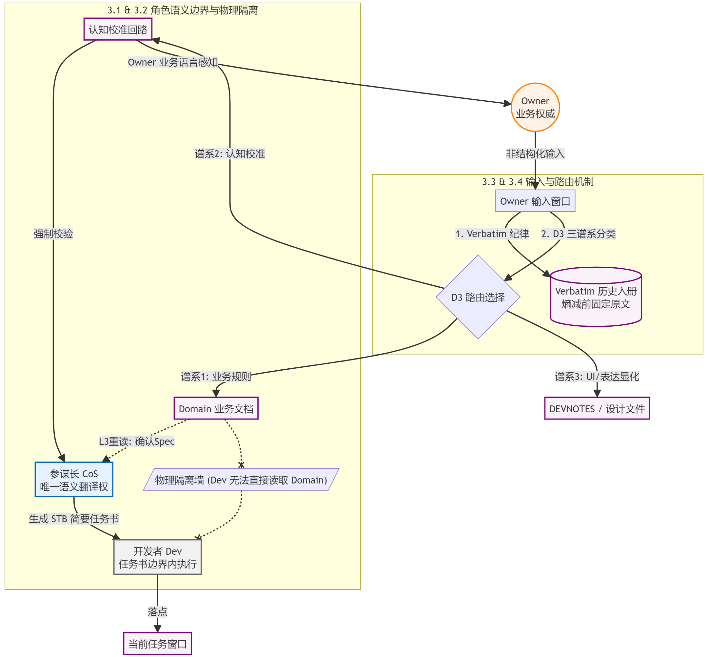

# 第三章：协作通信系统

> 产业界认为协作失败是上下文质量问题——信息组织得不够好，角色定义得不够精确。CSF 的发现是：上下文质量从来不是上限——信息在角色间传递时的物理损失，才是协作质量的真正上限。

---

语义漂移不是执行问题，是传递问题。

**协作质量由传递结构决定——减少不必要的传递，在传递发生时固定信息，在理解偏差出现时有机制捕捉。**

信息从 A 传到 B，B 接收时展开为多种解读（熵增），B 选择 " 最大可能 " 理解后再传给 C（熵减）——每一次传递，原始语义都在这个循环里被消耗。CrewAI、AutoGen、MetaGPT 的多角色框架对此没有任何结构性回应：它们设计了角色分工，但每一次角色间的传递，熵增熵减照常发生。

---

## 3.1 三角色：能力边界的活性定位

AI 的活性是智能的源泉，也是传递损失的放大器。在边界内，活性产生有价值的推断；一旦越界，活性就会沦为破坏性的幻觉。

因此，协作结构的首要问题不是 " 谁做什么 "（职责划分），而是 **" 谁在哪个抽象层次上有权操作语义 "（能力边界）**。

职责划分仅决定任务归属，能力边界才决定语义控制权。在协作中，越权操作语义本质上是在**用自己的弱能力替换对方的强能力**，这是传递损失的最大源头。

CSF 的三角色设计，本质上是对能力边界的活性定位：

- **Owner（业务权威）**：业务真相的终极定义者与纠偏者。业务本身是唯一真理。Owner 若越界去设计架构，是用直觉经验替换 AI 的知识广度；AI 若越界去解读业务目的，是用概率推断替换人类的业务决策。
- **参谋长（CoS）**：传递链上的 " 语义翻译官 "。负责将 Owner 脑中非结构化、随对话涌现的业务意图，转化为开发者可以直接消费的设计决策。他是防止语义失真的第一道防线。
- **开发者（Dev）**：任务书（STB）边界内的物理执行者。Dev 原则上不直接接触 Domain 文档，只在 STB 划定的上下文和代码边界内进行高效率的实现。

> [!note] 关于 Dev 的 " 自决越界 "
> 原则上，Dev 不允许越界读写。但为了工程效率，CSF 允许 Dev 在**实现细节（如任务书范围之外的局部关联代码）**上进行自决越界。必须强调的是：这种越界是代码实现层面的自决，而非对上游业务语义的篡改，且越界后必须说明原因并记录影响范围，防止语义漂移在最底层悄悄发生。

三角色的活性定位确立了一条根本原则：**每个角色只在自己认知最强的区域操作语义，然后将结果单向传递给下一层。** 越界不只是规则的违反，更是对系统工程能力的物理损耗。

明确了 " 谁有权操作语义 " 之后，下一个问题是：如何防止语义在流转中被不必要地重新解读？

---

## 3.2 物理隔离：切断不必要的传递环节

减少传递损失最直接的方法：减少传递次数。

行业的方案是提示词约束——告诉角色 " 你不应该读 X"。问题不是执行力度，而是信息仍然存在于角色的上下文里。角色会对它产生解读，进而影响后续输出，无论提示词怎么约束，读过了就会有相应的冲动产生。

CSF 的方案是物理隔离：**开发者的上下文里，根本不存在 Domain 文档。**

不是 " 开发者不应该读 Domain"，是开发者的工作输入——任务书（STB）——已经包含了足够的来龙去脉。开发者的理解发生在参谋长为他准备的充足语境之中，而不是对精炼结论的再解读。脱离语境的结论会再次触发熵增；带语境的结论，把猜测空间压缩到最小，把开发者自己去 " 找资料 " 或 " 脑补 " 的动机压缩到最小。

物理隔离保证了传递链的结构完整性。但还有一个问题：语义从 Owner 进入系统时，如何保证第一次传递不失真？

---

## 3.3 Verbatim 入册：在熵减发生之前固定信息

信息在人机传递中存在一个物理衰变过程：Owner 说出一句话，接收方展开多种解读（熵增），最终过滤并选择一个 " 最大可能 " 转化为设计决策（熵减）。在这个不可逆的 " 熵减 " 转化中，Owner 原话中的高维语义和微妙边界会永久消失。

**Verbatim（原文照搬）入册，是对这一物理过程的强行干预。**

它的铁律是：在任何转化发生之前，将 Owner 的原话以最原始的形态固定下来——不改写、不总结、不翻译，严格标注日期、会话编号和双引号。

这一机制在工程和认知上具有双重价值：

- **第一，作为 LLM 的 " 高维激活源 "**。人类的原话富含独特的隐喻、语气和业务场景的微妙上下文。大模型对这种高维语义高度敏感。如果由参谋长总结后再传给 AI，这些高维信息就被过滤成了平庸、扁平的指令。保留原话，就是保留了能够随时激活 AI 深度推断能力的 " 语义火种 "。
- **第二，保留业务真相的 " 推导路径 "**。结论只是过程的截面，脱离过程的结论会再次触发理解偏差。Verbatim 保护的不是 Owner 的个人言论，而是业务真相的涌现过程。随着项目推进，之前的设计可能会被推翻，但 Verbatim 记录了 " 当时的理解是如何一步步形成的 "——包括被排除的路径和纠偏的措辞。当业务理解需要更新时，团队可以瞬间回到历史现场，看清是哪个环节需要更精确地替代，而不是凭空猜测。

无论后续的理解经历了多少次迭代，Verbatim 始终作为不可磨灭的物理锚点，确保源头信息不失真。

---

## 3.4 D3 三谱系与 Owner 输入窗口：业务真相的完整生命周期

业务真相在项目推进过程中持续涌现，以不同的形态进入系统：Owner 第一次说出一条业务规则，AI 对业务的理解偏离真相被纠偏，业务规则稳定但表达层需要更新。三种形态需要不同的处理方式。混淆它们，代价是不对称的——把认知偏差当新规则处理，漏掉了一次必要的全面校验；把新规则当认知偏差处理，浪费了 Owner 的时间。

D3 三谱系 [^1] 是业务输入的分类路由机制：

**谱系 1（业务规则明文化）**：Owner 第一次说出这条规则，与已有文档不冲突。可以安全修改 Domain 文档，简单校验即可。

**谱系 2（认知校准）**：AI 或团队对业务的理解偏离了真相，被 Owner 纠偏。必须 Owner 在场并校验业务理解——由参谋长使用业务语言讲述哪些已有设计决策和/或哪些 spec 受到如何的影响，由 Owner 基于业务语义感知误差。谱系 2 是整个协作通信系统的纠偏探针：它的触发，说明传递中出了问题，或者理解上获得了新知。

**谱系 3（UI 显化）**：业务规则已稳定，只是表达层或交互层需要更新。落点是设计文件，不污染业务文档。

三谱系的核心价值不是分类，是**让每一次业务输入都知道自己是什么性质，触发什么动作**。

Owner 业务输入窗口是三谱系的上游机制。Owner 的每一次业务输入都通过这个窗口进入，按三档分类（细节级/跨包契约级/设计岔路口），verbatim 收录，落到三处长期承载点（DEVNOTES[^2]/Domain 文档/任务窗口）。任何业务输入不能只活在当前会话的上下文里——会话结束，上下文消失，信息随之失忆。

两个机制合在一起，覆盖了业务真相的完整生命周期：从 Owner 认知中涌现（输入窗口接收）→ 识别性质触发对应动作（三谱系路由）→ 以带语境的形式长期承载（三处落点）→ 偏差发生时有探针捕捉（谱系 2 强制校验）。

---

## 结论

本章证明了一件事：协作通信系统的设计起点，是承认信息传递的物理损失不可消除——只能减少传递次数，在传递发生时固定信息，在损失已经发生时有机制捕捉。

产业界的多角色框架设计了角色分工和任务流转——但每一次角色间的传递，语义完整性在消耗，框架对此没有任何结构性回应。更根本的问题是：这些框架假设更好的角色定义能减少误解——这是在用能力质量替代结构保证。**能力质量是概率性的，传递损失是物理性的，两者不在同一个层次。**

CSF 的四个机制各自对应传递损失的一个控制点：

- **三角色活性定位**：这不是角色分工，而是确定谁在哪个抽象层次上有权操作语义——越界是用弱能力替换强能力，主动放大传递损失
- **物理隔离**：切断不必要的传递环节——这不是权限管理，而是传递链的结构设计，少一次传递就少一次熵增熵减循环
- **Verbatim 入册**：在熵减发生之前固定信息——这不是记录习惯，而是对传递物理过程的干预，保留过程而非只保留结论
- **D3 三谱系 +Owner 输入窗口**：覆盖业务真相的完整生命周期——这不是分类系统，而是传递损失的捕捉机制，是整个系统对已发生损失的有效修复路径

协作通信系统建立之后，传递结构已经就位。剩下的问题是：当执行层的输出与业务意图出现偏差时，如何在抽象边界处系统性地发现、定位、修正？这是第四章的问题。

---

[^1]: D3 的符号来源：Devnotes（保存技术决策），Domain（保存领域和业务定义），Design（保存 UI 规范），即 3 类会影响业务决策和业务理解的信息。
[^2]: DEVNOTES，是 CSF 中让 SoC 和 Dev 用来随手记的 " 技术备忘录 "，记录一些设计决策，技术路线选择，局部开发约定等。
