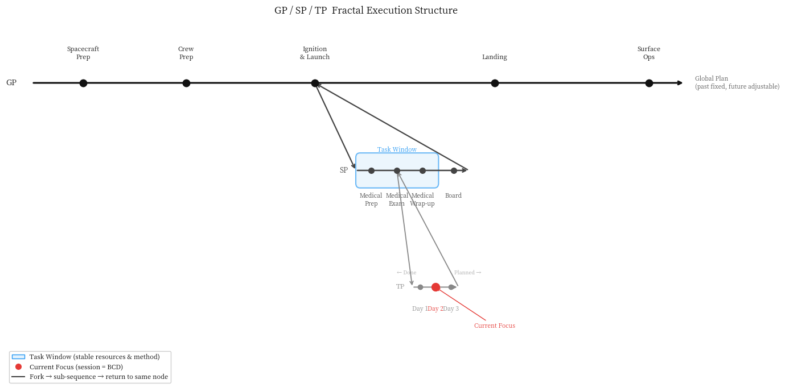

---

# Chapter 2: Semantic Management System

> The industry spent three years optimizing *what* enters the context window. CSF asks *why* it enters—without a clear purpose, even the most precise retrieval is merely noise.

---

Drift is not a problem of information loss.

In 2024, purpose was hardcoded at the end of the System Prompt—"Your goal is to…". The flaw in this design quickly became apparent: purpose is static, while execution is dynamic. As a session progresses, the relative attention weight of that single sentence decays, and drift inevitably occurs.

The industry's response was to upgrade the engineering form of purpose. Between 2025 and 2026, mainstream AI engineering methodologies began structuring purpose: *Goal as State Machine*—deconstructing purpose into intent states and exit condition assertions; *Runtime Governance*—employing an independent governance layer to evaluate whether vector trajectories deviate from purpose boundaries after every step; and *Why/What Layering*—relying on high-end reasoning models for purpose anchoring, while the execution layer maintains context purity, dynamically loading context based only on decomposed subtasks. This direction is correct: purpose must be structured; it cannot remain a mere descriptive text. [^1]

However, the underlying assumption of this approach is flawed.

Anthropic termed this line of work "context engineering": the curation and maintenance of the optimal token set during inference. Within this framework, even when structured as a state machine, purpose remains an organizational basis for context, rather than the control unit of the collaborative structure. Runtime Governance guards the formal boundaries of purpose—vector trajectories, assertion conditions—operating at the token and state layers. [^2]

The Pang Principle states: *Over time, the information a single expression has to carry grows—inevitably, everywhere, without exception—and its semantics get diluted.* Semantic dilution does not occur at the token layer; it happens at the semantic layer. Vector distance cannot determine whether a purpose has been distorted—because a semantically distorted purpose can still remain extremely close in vector space. The governance layer intercepts deviation, not dilution. No matter how precise the state machine is, the semantic integrity of the purpose remains unguarded because the mechanism to protect it does not reside at the semantic layer.

**The industry delegates the safeguarding of purpose to an external governance layer. CSF insists that the safeguarding of purpose must be endogenous to the collaborative structure, and humans must remain in the loop.**

To understand how this endogenous mechanism works, we must first establish a spatial sense of the execution structure.

---

## 2.1 Execution Structure: The Fractal Container of Purpose



The ultimate purpose of a project is the endpoint of its Panorama.

The Panorama is not a plan; it is the spatial unfolding of purpose. Once the endpoint is defined, the path decomposes accordingly: each phase has its own purpose, and each task has its own purpose. Purposes nest within purposes, forming a hierarchy of GP (Global Plan) → SP (Stage Plan) → TP (Theme Plan). The internal structure of each layer is identical to the whole—tasks can be infinitely decomposed, but every single level must have a clear purpose, or the decomposition is invalid.

This structure consists of three key elements:

- **Window**: A stable working phase where resources, objects, and methods remain constant. The boundary of a window is not defined by a calendar, but by the question: *"Has the set of things we need to interact with fundamentally changed?"* When a window shifts, the old content is cleared, and the new window loads a fresh set.
- **Red Dot**: The current focus. Knowing where the Red Dot is means knowing: what we are doing, where we left off last time, and what we must do now.
- **Panorama**: Past nodes are immutable, while future nodes update as understanding progresses. It is a reflection of the project's current state of cognition, not a frozen commitment.

The execution structure establishes the space where purpose exists. But space alone does not transmit purpose—how purpose is activated in each session, how it dictates information partitioning, and how it remains stable across sessions under memoryless constraints are the subjects of the next three sections.

---

## 2.2 The Triad: The Convergence Device of Purpose

The execution structure defines the scale at which purpose exists—GP, SP, and TP each have their own purposes. The next question is: at the scale of a single session, how does purpose rapidly activate and converge?

The industry's upgrade path is *Goal as State Machine*—compressing purpose into states and assertion conditions, using a governance layer to enforce runtime checkpoints.[^1] While this solves the verifiability of purpose, it introduces a new problem: state machines are formal, while purposes are semantic. Compressing semantic purpose into state assertions inevitably causes information loss. The lost portion is precisely the business judgment and contextual understanding—the very parts where humans excel and machines find hardest to replace.

CSF's solution is **The Triad: Purpose + Method + Resource**.

The Triad is neither a more detailed task description nor another way of writing a state machine. It is a semantic convergence device. When the AI reads the Triad, its semantic system automatically converges onto the correct subset of capabilities: it knows what it is doing (**Purpose**), how to do it (**Method**), and where to find the materials (**Resource**). If any of the three is missing, convergence is incomplete.

The Triad follows a strict logical sequence. Before the purpose is defined, the method is meaningless. Before the method is chosen, the resource has no boundaries. The industry often lists resources first and then figures out how to use them; this reverses cause and effect. The boundaries of resources are determined by the method, and the choice of method is dictated by the purpose. CSF's sequence is *Purpose → Method → Resource*. The causal chain flows from semantics to operations and is strictly irreversible.

The Triad serves as the control unit of the task window. When the window shifts, the Triad completely overwrites the context with the new environment, and the old content no longer occupies semantic space. The transmission of purpose does not rely on external checkpoints of a governance layer; it is reactivated at the start of every session through the structure itself.

---

## 2.3 Knowledge Layering: How Purpose Dictates Information Partitioning

The Triad solves purpose convergence for a single session. But for purpose to transmit, we must solve another problem: how to organize the accumulated knowledge of a project so that executors at each layer see only what they need to see.

The industry's *Why/What Layering* approach relies on high-end reasoning models for purpose anchoring, while the execution layer maintains context purity. This direction is correct—the execution layer should not be drowned in the full complexity of the purpose. However, this approach delegates the separation of Why/What to model capabilities (reasoning models vs. execution models) rather than to the collaborative structure. Model capabilities are probabilistic; collaborative structures are deterministic.

CSF's knowledge organization principle is **layer-by-layer information decoupling**, guaranteed by structure rather than model capability:

```
Domain → Arch → Themes → STB (Simple Task Brief)
```

- **Domain** represents the business truth: the Owner's judgments, core product rules, and business logic that remain invariant regardless of implementation. It holds the highest authority and changes the least.
- **Arch** is the architectural design: translating the business intent of the Domain into system structures.
- **Themes** are the design contracts: distilling materials that developers can directly consume from the Domain and Arch—not summaries of raw data, but deliberate design decisions.
- **STB** is the input for a single session: which files to modify, which references to consult, and the acceptance assertions for each task point.

Each layer passing information downward represents a deliberate refinement of information. The upper layer prepares knowledge for the lower layer, answering a single question: **What does the next layer need to know—and what must it not know—to just get its job done?**

Unidirectionality is the core of this architecture, and it is more than just cognitive load management. If a developer directly accesses the Domain, **"Semantic Penetration"** occurs: they will interpret the business truth using their own understanding, bypassing the Chief of Staff's judgment layer. The integrity of the business semantics will be damaged in this bypass. Restricting information flow strictly from upstream to downstream is a **structural defense against semantic penetration**, not a permission design.

---

## 2.4 Localization Management and Cross-Session Convergence: Timing and Continuity

Knowledge layering solves *what* to load. Two questions remain: *when* to load it, and *how* to maintain continuity across sessions. These two questions are two dimensions of the same mechanism.

The industry's anxiety over context windows is an anxiety of capacity. The emergence of 2M-token long-context models did not make this anxiety disappear—larger windows dilute attention, making drift more insidious. Anthropic's research termed this **"context rot"**: as the number of tokens in a window increases, the model's ability to accurately recall information degrades, continuously draining its attention budget. Solutions like LangMem delegate the decision of what to persist to the model itself—handing memory judgment to the machine. Without a purpose structure, the model cannot know what is important. [^2]

Capacity is not the issue. The issue is putting the right things in at the right time.

- **Sliding Window** manages the transition between task phases. Within a window, the Triad remains relatively stable—multiple sessions share the same window, with only the specific progress of each session changing. The trigger for a window shift is when "the set of things being interacted with has completely changed," not time or task count.
- **Lazy Loading** manages the on-demand loading of documents. It is triggered by rules (reading specifications only when required by protocol) or commands (the user reminding the AI of a specific scenario, prompting it to load the corresponding specification). The core principle: read with a purpose, so you know when you have read enough.
- **Three-Tier Indexing** manages document localizability: self-explaining filenames, active pointers (changelog endnotes indicating resource scope), and stable references (alias mechanisms to prevent broken links from renaming).

Cross-session continuity is carried by the four-chapter structure of the context: §A is the immutable base (project background, role definitions, core principles); §B is the current task window's Triad; §C is the conclusion of the last session; and §D is the plan for the next session. After reading these four chapters at the start of every session, the AI knows exactly: what the project is, what phase we are in, where we left off, and what to do now.

```markdown
┌────────────────────────────────────────────────────────┐
│ §A Project Base   -> "Who am I, and what are we doing?"│
├────────────────────────────────────────────────────────┤
│ §B Task Window    -> The current stage's [Triad]       │
├────────────────────────────────────────────────────────┤
│ §C Last Session   -> Where we left off (anti-amnesia)  │
├────────────────────────────────────────────────────────┤
│ §D Next Steps     -> What we do this time (anti-drift) │
└────────────────────────────────────────────────────────┘
```

LLMs have no cross-session memory; this is a physical fact. CSF does not fight it; it accepts it as a design premise. By writing what needs to be remembered externally and reactivating it at the start of every session, the system's reliability does not decay with the number of sessions.

The execution protocol for this mechanism is the two-stage read: **L2 Light Read** (look up to see the road: read §B and the Panorama to establish direction) → **L3 Heavy Read** (look down to do the work: carry the L2 direction to read the Domain authority documents and architecture specs, ensuring the immediate, concrete task is executed without omissions or hallucinations). The order is irreversible—an L3 read without L2 is a blind plunge; an L2 read without L3 is a suspended direction.

While the industry competes for "larger funnels" (expanding window capacity) to combat Context Rot, CSF focuses on **"hyper-precise valves."** The combination of **Sliding Window, Lazy Loading, and Three-Tier Indexing** is not a file management system; it is a **dynamic defense of the LLM's limited attention bandwidth**—delivering the most precise semantic activation sources into the window only when needed.

---

## Conclusion

This chapter proves one thing: the core of semantic management is not information management, but purpose transmission.

The industry has realized that purpose must be structured—*Goal as State Machine, Runtime Governance, and Why/What Layering* are all steps in the right direction. However, they delegate the safeguarding of purpose to an external governance layer, using vector trajectories and assertion conditions to judge whether purpose has been distorted. This attempts to handle semantic problems at the token and state layers. Vector distance cannot judge semantic integrity, and assertion conditions cannot capture the subtle distortions of business judgment.

The four mechanisms of CSF address four dimensions of this single fundamental problem:

- **Execution Structure**: Defines the scale at which purpose exists, decomposing it layer-by-layer from the Panorama's endpoint.
- **The Triad**: Activates and converges purpose within a single session—a semantic device, not a state machine.
- **Knowledge Layering**: Dictates how information is partitioned and flows unidirectionally between layers—guaranteed by structure, not model capability.
- **Localization Management and Cross-Session Convergence**: Determines loading triggers and maintains cross-session stability under memoryless constraints.

This dispels three common misconceptions. First, that CSF is merely a better prompting technique—it is not; prompting optimizes the expression quality of purpose, whereas CSF designs the transmission structure of purpose. Second, that CSF simply replaces memory systems with a file system—it does not; memory systems solve "what the AI remembers," whereas CSF solves "how purpose remains undistorted across the human-AI collaboration chain." Third, that CSF is just a lightweight alternative to Runtime Governance—it is not; Runtime Governance guards the formal boundaries of purpose, while CSF guards its semantic integrity. They operate at entirely different levels.

With the semantic management system established, the remaining question is: how should labor be divided between humans and AI to ensure that purpose is not overreached, diluted, or mistranslated during transmission? This is the subject of Chapter 3.

---

[^1]: **"From Prompt–Response to Goal-Directed Systems: The Evolution of Agentic AI Software Architecture"** Mamdouh Alenezi, The Saudi Technology and Security Comprehensive Control Company "Tahakom", Riyadh [arxiv.org/html/2602.10479v1](https://arxiv.org/html/2602.10479v1)
[^2]: **"Effective context engineering for AI agents"** Anthropic Engineering Blog, Published Sep 29, 2025 [anthropic.com/engineering/effective-context-engineering-for-ai-agents](https://anthropic.com/engineering/effective-context-engineering-for-ai-agents)
