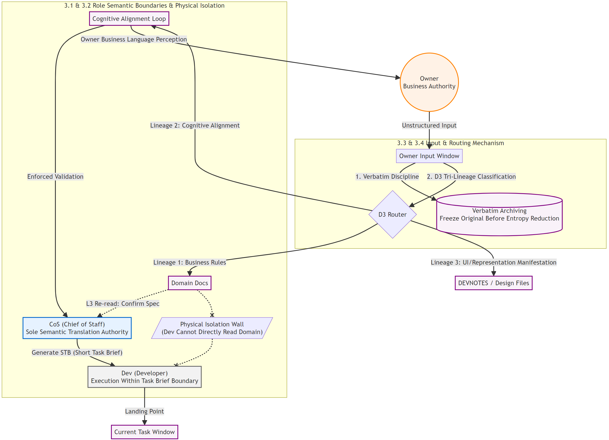

---

# Chapter 3: Collaborative Communication System

> The industry believes that collaboration failure is a context quality issue—that information is not organized well enough, or roles are not defined precisely enough. CSF's discovery is: context quality is never the ceiling—the physical loss of information as it is passed between roles is the true ceiling of collaboration quality.

---

Semantic drift is not an execution problem; it is a transmission problem.

**Collaboration quality is determined by the transmission structure—minimizing unnecessary handoffs, freezing information when transmission occurs, and establishing mechanisms to catch comprehension deviations when they arise.**

Information travels from A to B. Upon receipt, B expands it into multiple interpretations (entropy increase), selects the "most probable" understanding, and passes it to C (entropy reduction)—with each handoff, the original semantics are consumed in this loop. Multi-role frameworks like CrewAI, AutoGen, and MetaGPT offer no structural response to this: they design division of labor, but with every inter-role handoff, the cycle of entropy increase and reduction occurs as usual.

---

## 3.1 Three Roles: Vitality-Based Positioning of Capability Boundaries

AI's vitality is the source of its intelligence, but also the amplifier of transmission loss. Within boundaries, vitality generates valuable inferences; once boundaries are crossed, vitality degenerates into destructive hallucinations.

Therefore, the primary question of a collaborative structure is not "who does what" (division of responsibility), but **"who has the authority to manipulate semantics at which level of abstraction" (capability boundaries)**.

Division of responsibility merely determines task ownership; capability boundaries determine semantic control. In collaboration, overreaching to manipulate semantics is essentially **replacing the other party's strongest capability with one's own weakest**, which is the greatest source of transmission loss.

CSF's three-role design is fundamentally a vitality-based positioning of capability boundaries:

- **Owner (Business Authority)**: The ultimate definer and corrector of business truth. The business itself is the sole source of truth. If the Owner overreaches to design architecture, they replace the AI's breadth of knowledge with empirical intuition. If the AI overreaches to interpret business purpose, it replaces human business decisions with probabilistic inference.
- **Chief of Staff (CoS)**: The "semantic translator" in the transmission chain. Responsible for converting the unstructured, conversational business intent in the Owner's mind into design decisions that developers can directly consume. The CoS is the first line of defense against semantic distortion.
- **Developer (Dev)**: The physical executor within the boundaries of the Simple Task Brief (STB). In principle, the Dev does not directly interact with Domain documents, executing high-efficiency implementations solely within the context and code boundaries defined by the STB.

> [!note] On Dev's "Autonomous Boundary-Crossing"
> In principle, the Dev is not permitted to read or write across boundaries. However, for engineering efficiency, CSF allows the Dev to perform autonomous boundary-crossing on **implementation details (such as local, related code outside the scope of the STB)**. It must be emphasized: this crossing is strictly an autonomous decision at the code-implementation level, not a tampering of upstream business semantics. Furthermore, the Dev must state the reason and record the scope of impact (typically in DEVNOTES or the session log) after crossing, preventing semantic drift from quietly occurring at the lowest level.

The vitality-based positioning of the three roles establishes a fundamental principle: **Each role operates semantics only in the region of its strongest cognition, then passes the results unidirectionally to the next layer.** Overreaching is not merely a violation of rules; it is a physical drain on the system's engineering capability.

Once "who has the authority to manipulate semantics" is clarified, the next question is: how do we prevent semantics from being unnecessarily re-interpreted during flow?

---

## 3.2 Physical Isolation: Cutting Unnecessary Transmission Links

The most direct way to reduce transmission loss is to reduce the number of handoffs.

The industry's solution is prompt constraint—telling a role "you should not read X." The problem is not the enforcement strength, but that the information still exists in the role's context. The role will interpret it, thereby influencing subsequent outputs. No matter how prompts constrain it, once read, the corresponding impulse will arise.

CSF's solution is physical isolation: **the Domain documents simply do not exist in the Developer's context.**

It is not that "the developer should not read the Domain"; it is that the developer's work input—the Simple Task Brief (STB)—already contains sufficient context. The developer's understanding occurs within the ample context prepared for them by the Chief of Staff, rather than through a re-interpretation of refined conclusions. Conclusions detached from their context trigger entropy increase once again; conclusions carrying context compress the space for guesswork to a minimum, reducing the developer's motivation to "find references" or "hallucinate" to near zero.

Physical isolation guarantees the structural integrity of the transmission chain. But another question remains: when semantics enter the system from the Owner, how do we ensure the first handoff is free of distortion?

---

## 3.3 Verbatim Recording: Freezing Information Before Entropy Reduction Occurs

Information undergoes a physical decay process during human-to-machine transmission: the Owner speaks a sentence, the receiver expands it into multiple interpretations (entropy increase), and finally filters and selects a "most probable" one to convert into a design decision (entropy reduction). In this irreversible "entropy reduction" conversion, the high-dimensional semantics and subtle boundaries of the Owner's original words are permanently lost.

**Verbatim (exact transcription) recording is a forceful intervention in this physical process.**

Its golden rule is: before any conversion occurs, freeze the Owner's original words in their most primitive form—no rewriting, no summarizing, no translating—strictly marked with dates, session numbers, and quotation marks.

This mechanism holds dual value, both in engineering and cognition:

- **First, as a "high-dimensional activation source" for the LLM.** Human original phrasing is rich with unique metaphors, tone, and the subtle context of business scenarios. Large models are highly sensitive to this high-dimensional semantics. If the Chief of Staff summarizes it before passing it to the AI, this high-dimensional information is filtered into flat, mediocre instructions. Preserving original words is preserving the "semantic spark" capable of activating the AI's deep inference capabilities at any time.
- **Second, preserving the "derivation path" of business truth.** A conclusion is merely a cross-section of a process; conclusions detached from the process trigger comprehension bias once again. Verbatim protects not the Owner's personal statements, but the emergence process of business truth. As the project progresses, prior designs may be overturned, but Verbatim records "how the understanding at the time was formed step-by-step"—including excluded paths and corrective phrasing. When business understanding needs to be updated, the team can instantly return to the historical scene, seeing exactly which link needs to be precisely replaced, rather than guessing in a vacuum.

No matter how many iterations subsequent understanding undergoes, Verbatim always stands as an indelible physical anchor, ensuring the source information remains undistorted.

---

## 3.4 The D3 Tri-Spectrum and the Owner Input Window: The Full Lifecycle of Business Truth

Business truth continuously emerges during project progression, entering the system in different states: the Owner states a business rule for the first time; the AI's understanding of the business deviates from the truth and is corrected; the business rule is stable, but the presentation layer needs an update. These three states require different handling. Confusing them carries asymmetric costs—treating a cognitive bias as a new rule misses a necessary comprehensive validation; treating a new rule as a cognitive bias wastes the Owner's time.

The D3 Tri-Spectrum [^1] is a classification and routing mechanism for business inputs:

- **Spectrum 1 (Codification of Business Rules)**: The Owner states this rule for the first time, and it does not conflict with existing documents. The Domain document can be safely modified with simple validation.
- **Spectrum 2 (Cognitive Alignment)**: The AI's or team's understanding of the business has deviated from the truth and is corrected by the Owner. The Owner must be present to validate the business understanding—the Chief of Staff uses business language to explain which existing design decisions and/or specs are affected and how, allowing the Owner to perceive the error based on business semantics. Spectrum 2 is the corrective probe of the entire collaborative communication system: its trigger indicates a breakdown in transmission or the discovery of new knowledge.
- **Spectrum 3 (UI Manifestation)**: The business rules are stable, and only the presentation or interaction layer needs updating. The landing point is design files, which do not pollute business documents.

The core value of the Tri-Spectrum is not classification, but **ensuring that every business input knows its own nature and triggers the corresponding action**.

The Owner Input Window is the upstream mechanism of the Tri-Spectrum. Every business input from the Owner enters through this window, is classified into three tiers (Detail / Cross-Package Contract / Design Fork), is recorded verbatim, and lands in three long-term storage points (DEVNOTES [^2] / Domain documents / Task Window). No business input can live solely within the context of the current session—when the session ends, the context vanishes, and the information is lost to amnesia.

Combined, these two mechanisms cover the full lifecycle of business truth: emerging from the Owner's cognition (received by the Input Window) → identifying its nature to trigger the corresponding action (routed by the Tri-Spectrum) → long-term storage with context (the three landing points) → catching deviations when they occur (mandatory validation via Spectrum 2).

---

## Conclusion

This chapter proves one thing: the starting point of designing a collaborative communication system is acknowledging that the physical loss of information transmission cannot be eliminated—it can only be minimized by reducing handoffs, freezing information when transmission occurs, and establishing mechanisms to catch losses when they have already occurred.

The industry's multi-role frameworks design role division and task flow—but with every transmission between roles, semantic integrity is consumed, and the frameworks offer no structural response to this. The more fundamental issue is that these frameworks assume better role definitions can reduce misunderstanding—this is replacing structural guarantees with capability quality. **Capability quality is probabilistic, while transmission loss is physical; they do not operate at the same level.**

The four mechanisms of CSF each correspond to a control point of transmission loss:

- **Three-Role Vitality Positioning**: This is not task division, but defining who has the authority to manipulate semantics at which level of abstraction—overreaching replaces strong capabilities with weak ones, actively magnifying transmission loss.
- **Physical Isolation**: Cuts unnecessary transmission links—this is not permission management, but the structural design of the transmission chain; one less handoff means one less cycle of entropy increase and reduction.
- **Verbatim Recording**: Freezes information before entropy reduction occurs—this is not a recording habit, but a structural intervention in the physical process of transmission, preserving the path rather than just the conclusion.
- **D3 Tri-Spectrum + Owner Input Window**: Covers the full lifecycle of business truth—this is not a classification system, but a transmission loss capture mechanism, providing an effective recovery path for losses that have already occurred.

With the collaborative communication system established, the transmission structure is in place. The remaining question is: when the execution layer's output deviates from the business intent, how do we systematically discover, locate, and correct it at the abstraction boundaries? This is the subject of Chapter 4.

---

[^1]: D3's symbolic origin: Devnotes (stores technical decisions), Domain (stores domain and business definitions), Design (stores UI specifications)—three types of information that affect business decisions and business understanding.
[^2]: DEVNOTES is a "technical memorandum" in CSF used by the CoS and Dev to jot down design decisions, technical path choices, local development conventions, etc.
